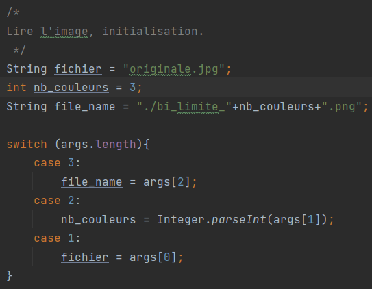
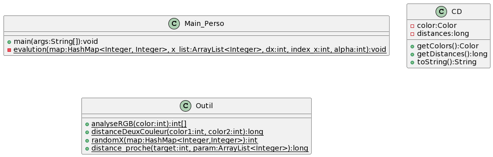
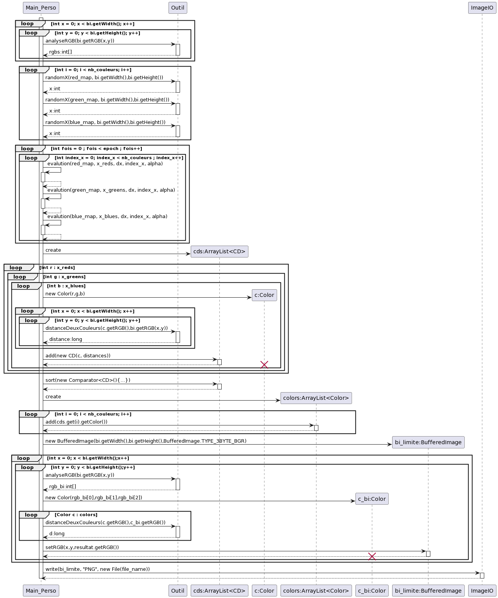
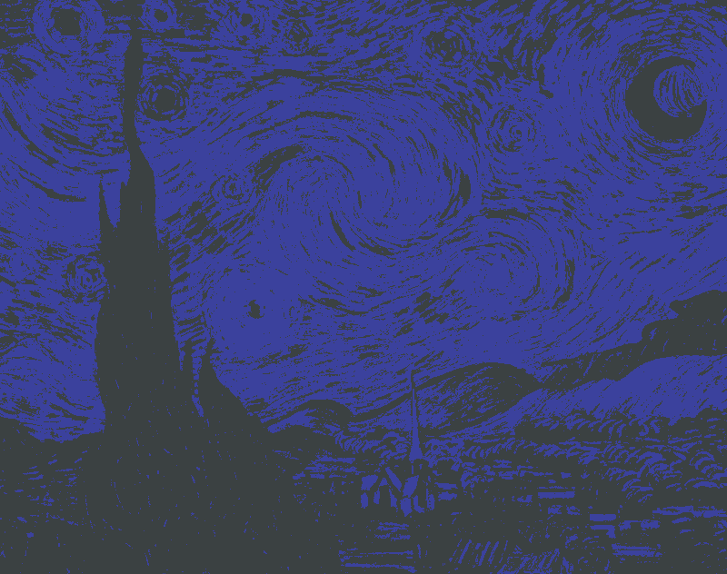

# SAE : Project IA
Dardenne Gregory, Xin Zhang
# Solution personnel

---
## idée principale:

***Distance(im1, im2) = Σ (p1,p2∈pixels) (R(p1) − R(p2))² + (G(p1) − G(p2))² + (B(p1) − B(p2))²***

En observant la formule de calcul de la distance entre deux images,
j'ai soudainement réalisé que les valeurs des paramètres R, G et B ne sont pas interdépendantes.
Autrement dit, je peux potentiellement diviser cette formule en trois parties distinctes
et chercher la valeur minimale pour chaque partie.
En ajoutant ces trois valeurs minimales,
le résultat final *Distance* devrait également être minimal.

## Comment lancer le programme?

le premier paramètre est le chemin du fichier d'entrée,
le deuxième paramètre est le nombre de couleurs, et le troisième
paramètre est le chemin du fichier de sortie.



## Algorithme:

1.Tout d'abord, nous créons trois histogrammes monochromes,
correspondant respectivement aux channels **R**, **G** et **B**,
et les stockons dans des Maps.

2.Remplir les Maps,
le nombre de pixels associés à chaque valeur de **R**, **G** ou **B**.

3.Choisir aléatoirement **n** (nb de couleur) fois la valeur de x , et
les stocker dans trois listes pour les channels **R**, **G**, **B**.

4.Utiliser la méthode de descente de gradient pour mettre à jour
les valeurs des x dans ces trois listes afin de trouver les chiffres
les plus représentatifs.

5.Effectuer des combinaisons sur les éléments des listes
R, G et B, puis sélectionner les **n** (nb de couleurs) combinaisons ayant les distances
les plus petites.

6.La signification de combiner les éléments de ces trois listes
est que nous avons maintenant obtenu les couleurs
les plus représentatives (R, G, B) que nous stockons
dans une liste. Ensuite, il est facile : nous parcourons
chaque pixel de l'image et choisissons la couleur de la liste qui
est la plus proche de la couleur du pixel, puis nous appliquons
cette couleur à notre image de sortie.

# Conception:





Maintenant, supposons que notre image ne comporte qu'un seul channel R
et que notre objectif est de trouver les **n** couleurs
les plus représentatives, les **n** valeurs entre 0 et 255.

**Comment trouver les chiffres les plus représentatifs
pour des données d'un histogramme ?**
Ma solution est de calculer la distance.

Supposons que notre chiffre le plus représentatif soit unique et
que nous ayons une liste [1, 1, 2, 3, 4, 9]. Dans ce cas,
nous pouvons établir l'équation de Distance = (1-x)² + (1-x)² +
(2-x)² + (3-x)² + (4-x)² + (9-x)². C'est une équation quadratique
à une variable, il est donc très facile de trouver la valeur minimale,
qui correspondra au chiffre le plus représentatif.

Cependant, lorsque nous avons deux chiffres les plus représentatifs,
la situation devient plus complexe. Supposons que les deux chiffres
les plus représentatifs soient respectivement 2 (***x1***) et 3 (***x2***).
Dans ce cas, le calcul de la distance devient
Distance=(1-2)²+(1-2)²+(2-2)²+(3-3)²+(4-3)²+(9-3)²,
c'est-à-dire Distance=(1-***x1***)²+(1-***x1***)²+(2-***x1***)²+(3-***x2***)²+(4-***x2***)²+(9-***x2***)².

Bien sûr, ici 2 et 3 ne sont certainement pas les solutions optimales,
il est donc nécessaire de trouver une méthode pour ajuster les valeurs de
***x1*** et ***x2*** de manière à minimiser la somme des distances par rapport
aux autres données de l'histogramme monochrome.

La méthode que j'ai envisagée consiste à utiliser l'algorithme de descente de gradient.
Tout d'abord, on obtient aléatoirement les valeurs de ***x1*** et ***x2***.
Ensuite, en fixant la valeur de ***x2***, on calcule Distance(***x1***+dx) et
Distance(***x1***-dx), puis on choisit la tendance qui réduit la distance,
pareil pour x2.

Ce méthode est applicable lorsque l'on souhaite trouver **n** chiffres les plus représentatifs.

Plus, on peut effectuer la même procédure pour le Map du channel G et le Map du channel B,
en récupérant les données et en les sauvegardant dans les liste.

Pourquoi avons-nous besoin de trouver les chiffres les plus représentatifs ?
Vous souvenez-vous de la formule que nous utilisons
pour calculer la distance entre deux images ?

***Distance(im1, im2) = Σ (p1,p2∈pixels) (R(p1) − R(p2))² + (G(p1) − G(p2))² + (B(p1) − B(p2))²***

Nous pouvons effectivement minimiser les valeurs des trois parties :
***(R(p1) - R(p2))²***, ***(G(p1) - G(p2))²*** et ***(B(p1) - B(p2))²***,
afin de réduire au maximum la distance.

Supposons que le nombre de couleurs soit de deux.
Nous aurons donc trois listes représentant R, G et B, et chaque
liste aura deux éléments représentant les chiffres les plus représentatifs
dans leurs histogrammes monochromes respectifs.

Example:
- List_R : 20, 40
- List_G : 100, 150
- List_B : 10, 60

Pour trouver les couleurs les plus représentatives,
nous combinons les éléments des trois listes et sélectionnons
celle dont la distance est minimale. ***(La distance est calculée en faisant
la somme des distances entre cette couleur et la couleur de chaque pixel
de l'image.)***

Une fois que nous avons trouvé les couleurs les plus représentatives,
il suffit de comparer la couleur de chaque pixel avec les couleurs de
la liste et d'écrire la couleur ayant la distance minimale dans la
nouvelle image.

## Quelques pistes pour améliorer ma solution...?
None...en fait, mon algorithme de base présente un problème,
car lors de la comparaison des couleurs, il est nécessaire de les comparer
individuellement en fonction des valeurs de R, G et B. Même si je
choisis la couleur la plus représentative avec une valeur R identique
à celle d'un pixel donné, si les valeurs de G et B sont élevées,
la distance totale reste grande. En fin de compte, les trois
solutions partielles optimales ne sont pas optimales globalement.

---

# Solution de la SAE

## Principe de la solution

Le principe de la solution est de réduit le nombre de couleur en gardant l'image
la plus synthétique possible. Pour cela, on va utiliser la méthode de K-means.

Pour cela, on utilise la classe point qui représente un pixel dans l'image.
Grâce à cette liste de points on va pouvoir faire un regroupement de chaque point
avec son centroid le plus porche.

Le centroid est un point qui représente le centre d'un groupe de point.


## Algorithme de la solution

```
Algo K-Means
début
    tant que non(fini) faire
        pour chaque cluster faire
            reset(centroid)
        fin pour
        
        pour chaque point faire
            pour chaque cluster faire
                distance <- distance(point, centroid)
                si distance < min_distance alors
                    min_cluster = cluster
                    min_distance = distance
                fin si
            fin pour
            add(min_cluster, point)
        fin pour
        
        pour chaque cluster faire
            centroid <- barycentre(cluster)
        fin pour
        
        fini <- old_cout > cout
    fin tant que
fin
```

## Conception
### Diagramme de classe

### Diagramme de séquence


## Comment lancer le programme

Le programme contient le chemin de l'image en clair dans le code
ainsi que le chemin de sortie, par défaut KMeans applique son algorithme
sur l'image du perroquet (resources/animaux/perroquet_small.png)
et sort l'image dans un dossier resources/out/perroquel_small_nbCouleurs.png)

Pour lancer le programme il suffit de s'assurer qu'un dossier out existe
dans resources et de lancer le main de la classe KMeans.

```java KMeans [nbCouleurs]```

Le nombre de couleur par défaut est de 10.

## Piste d'amélioration

Changer la condition de fin. Dans mon cas l'algorithme s'arrête dès
que le cout augmente, cependant le fait qu'il monte ne signifie pas
forcément que l'algorithme est terminé. Il faudrait donc trouver une
autre condition de fin. Pour permettre à l'algorithme d'avoir un cout qui monte
si ça lui permet de redescendre.

Améliorer la rapidité de l'algorithme, trouver une solution qui permettrait
de réduire le temps de calcul. De chaque cluster. Plus il y a de couleurs
plus le temps de calcul prends du temps.


# Tests

---

# Test et analyse de la solution personnel

## Lance du test

Le programme de test ne prend qu'un seul argument,
qui représente le nombre de couleurs. Une fois le programme lancé,
il essaiera de trouver les images requises dans le dossier actuel
et générera une nouvelle image dans ce même dossier.

## Images utilisées


Mario! La raison de choisir ce personnage est que son environnement est blanc.
Dans ce cas, les couleurs les plus représentatives devraient inclure le blanc.


Lotus, C'est une belle image. La partie centrale de la fleur de lotus est lumineuse
tandis que l'environnement qui l'entoure est sombre.


C'est une œuvre abstraite, les couleurs semblent assez chaotiques. Cela pourrait affecter mon programme.


Si vous observez attentivement cet ours,
vous remarquerez que son corps passe d'une couleur sombre
en bas à une couleur claire en haut. C'est un bon exemple
pour tester mon programme.


C'est une image avec des couleurs très sombres. Il serait préférable de
choisir une image avec des couleurs plus sombres.

## Résultats obtenus

**mario_small.png:**

Réduction à 2 couleurs


4 couleurs


10 couleurs


**originale.jpg:**

Réduction à 2 couleurs


4 couleurs


10 couleurs


**van-Gogh-Night_small.png:**

Réduction à 2 couleurs



4 couleurs


10 couleurs


**ours.png:**

Réduction à 2 couleurs


4 couleurs


10 couleurs


**Stranger_Things_logo.png:**

Réduction à 2 couleurs


4 couleurs


10 couleurs


Graphique représentant la relation entre le nombre de couleurs et le temps de calcul(*ms*).


## Analyse et Conclusion

Vous pouvez observer que plus le nombre de couleurs augmente,
plus les parties lumineuses de l'image deviennent sombres.

Quant au logo de Stranger Things, l'image devient presque entièrement noire.
(***Si vous regardez attentivement, vous pourrez distinguer les lettres,
mais ils sont très sombres.***)

Pourquoi cela se produit-il ? La réponse est simple, mon algorithme a un problème.

Prenons l'exemple du logo de Stranger Things. La majeure
partie de l'image est de couleur noire (***0***), ce qui signifie que
les valeurs les plus représentatives tendront à se rapprocher de
la couleur noire (***0***). Parce que lors du calcul, il prend en
compte les valeurs globales.

En réalité, l'image de Mario présente également le même problème.
L'œil humain est plus capable de distinguer les couleurs claires,
tandis que pour les couleurs sombres, même si elles ne sont pas
purement noires, elles peuvent sembler noires à nos yeux.

Un autre problème est que les images générées par ma solution
ne sont pas assez stables.

**Images avec 10 couleurs:**


Ce phénomène est facile à expliquer.
Lorsque nous utilisons la méthode de descente de gradient pour
calculer les chiffres les plus représentatifs, les valeurs des
nombres peuvent fluctuer. Les nouvelles couleurs formées sont
déterminées par les trois valeurs de R, G et B combinées.
Par conséquent, lorsque ces valeurs changent, les
couleurs peuvent subir des changements importants.

## Piste d'amélioration possible
None...Comme je l'ai mentionné précédemment,
mon algorithme présente des problèmes car il prend en
compte les valeurs globales lors du calcul, et le temps
d'exécution augmente de manière cubique avec le nombre de couleurs.
Si je souhaite améliorer l'algorithme, il peut être nécessaire de
réécrire le programme depuis le début.

---

## Test de la solution de la SAE

### Image utilisé


J'utilisais cette image pour mes tests, elle m'a semblé la plus complexe
dû à son nombre de couleur et aux détails qu'il y avait

### Image généré avec 8 couleurs


La plus grosse difficulté semble être l'arrière plan
de l'image, les branches ont perdus leurs détails cependant
elles restent reconnaissable.

### Image généré avec 16 couleurs


Le perroquet a plus de détail et l'arrière plan aussi.
L'image généré ressemble à une image dans un cartoon.

### Image généré avec 32 couleurs


A partir de 32 coulleurs le perroquet semble bien représenter l'original
et l'arrière plan commence à avoir des détails. Tels que les branches.


### Graphique fait sur l'algorithme


Le graphique représente le temps de calcul de l'algorithme en fonction
du nombre de couleur. On peut voir que le temps de calcul augmente
de manière linéaire.

### Manière de relancer mes tests

Pour relancer mes tests il suffit de lancer le fichier
de test ayant pour chemin test/saeSolution/TestKMeans.java

### Conclusion

L'algorithme de K-Means est un algorithme qui permet de réduire le nombre
de couleur d'une image. Cependant il est très gourmand en temps de calcul
et il est difficile de trouver une condition de fin qui permettrait
de réduire le temps de calcul.

