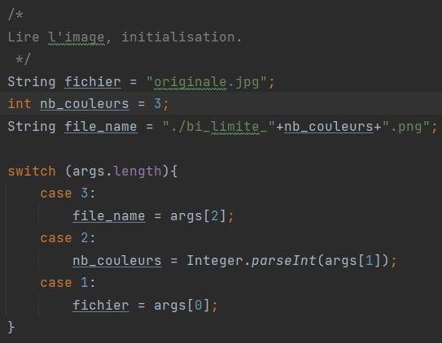
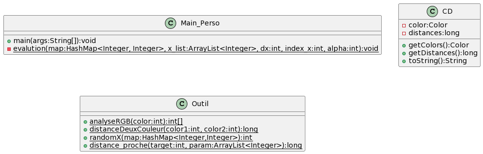
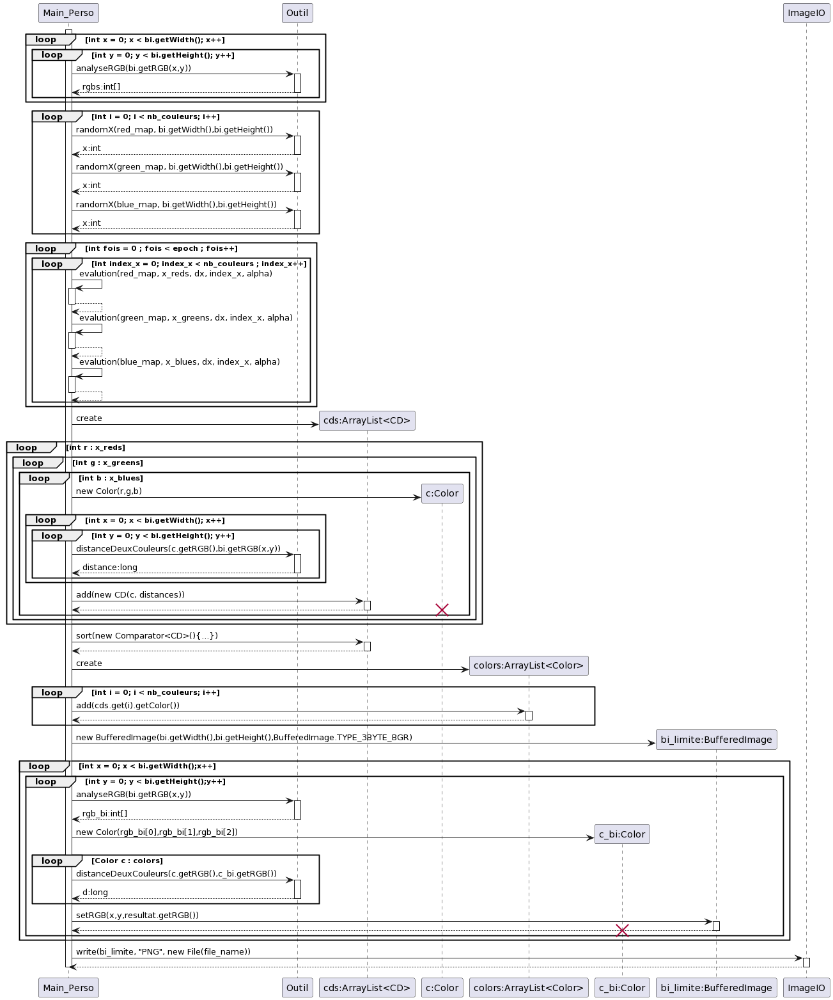

# Solution Personelle

---
## idée principale:

***Distance(im1, im2) = Σ (p1,p2∈pixels) (R(p1) − R(p2))² + (G(p1) − G(p2))² + (B(p1) − B(p2))²***

En observant la formule de calcul de la distance entre deux images,
j'ai soudainement réalisé que les valeurs des paramètres R, G et B ne sont pas interdépendantes. 
Autrement dit, je peux potentiellement diviser cette formule en trois parties distinctes 
et chercher la valeur minimale pour chaque partie. 
En ajoutant ces trois valeurs minimales, 
le résultat final *Distance* devrait également être minimal.

## Comment lancer le programme?

le premier paramètre est le chemin du fichier d'entrée, 
le deuxième paramètre est le nombre de couleurs, et le troisième 
paramètre est le chemin du fichier de sortie.

## Algorithme:

1.Tout d'abord, nous créons trois histogrammes monochromes, 
correspondant respectivement aux channels **R**, **G** et **B**,
et les stockons dans des Maps.

2.Remplir les Maps, 
le nombre de pixels associés à chaque valeur de **R**, **G** ou **B**.

3.Choisir aléatoirement **n** (nb de couleur) fois la valeur de x , et 
les stocker dans trois listes pour les channels **R**, **G**, **B**.

4.Utiliser la méthode de descente de gradient pour mettre à jour 
les valeurs des x dans ces trois listes afin de trouver les chiffres
les plus représentatifs.

5.Effectuer des combinaisons sur les éléments des listes 
R, G et B, puis sélectionner les **n** (nb de couleurs) combinaisons ayant les distances 
les plus petites.

6.La signification de combiner les éléments de ces trois listes 
est que nous avons maintenant obtenu les couleurs 
les plus représentatives (R, G, B) que nous stockons 
dans une liste. Ensuite, il est facile : nous parcourons 
chaque pixel de l'image et choisissons la couleur de la liste qui 
est la plus proche de la couleur du pixel, puis nous appliquons 
cette couleur à notre image de sortie.

# Conception:

Maintenant, supposons que notre image ne comporte qu'un seul channel R 
et que notre objectif est de trouver les **n** couleurs 
les plus représentatives, les **n** valeurs entre 0 et 255.

**Comment trouver les chiffres les plus représentatifs 
pour des données d'un histogramme ?** 
Ma solution est de calculer la distance.

Supposons que notre chiffre le plus représentatif soit unique et 
que nous ayons une liste [1, 1, 2, 3, 4, 9]. Dans ce cas, 
nous pouvons établir l'équation de Distance = (1-x)² + (1-x)² + 
(2-x)² + (3-x)² + (4-x)² + (9-x)². C'est une équation quadratique 
à une variable, il est donc très facile de trouver la valeur minimale, 
qui correspondra au chiffre le plus représentatif.

Cependant, lorsque nous avons deux chiffres les plus représentatifs, 
la situation devient plus complexe. Supposons que les deux chiffres 
les plus représentatifs soient respectivement 2 (***x1***) et 3 (***x2***). 
Dans ce cas, le calcul de la distance devient 
Distance=(1-2)²+(1-2)²+(2-2)²+(3-3)²+(4-3)²+(9-3)², 
c'est-à-dire Distance=(1-***x1***)²+(1-***x1***)²+(2-***x1***)²+(3-***x2***)²+(4-***x2***)²+(9-***x2***)².

Bien sûr, ici 2 et 3 ne sont certainement pas les solutions optimales, 
il est donc nécessaire de trouver une méthode pour ajuster les valeurs de 
***x1*** et ***x2*** de manière à minimiser la somme des distances par rapport 
aux autres données de l'histogramme monochrome.

La méthode que j'ai envisagée consiste à utiliser l'algorithme de descente de gradient.
Tout d'abord, on obtient aléatoirement les valeurs de ***x1*** et ***x2***. 
Ensuite, en fixant la valeur de ***x2***, on calcule Distance(***x1***+dx) et 
Distance(***x1***-dx), puis on choisit la tendance qui réduit la distance, 
pareil pour ***x2***.

Ce méthode est applicable lorsque l'on souhaite trouver **n** chiffres les plus représentatifs.

Plus, on peut effectuer la même procédure pour le Map du channel G et le Map du channel B, 
en récupérant les données et en les sauvegardant dans les liste.

Pourquoi avons-nous besoin de trouver les chiffres les plus représentatifs ? 
Vous souvenez-vous de la formule que nous utilisons 
pour calculer la distance entre deux images ?

***Distance(im1, im2) = Σ (p1,p2∈pixels) (R(p1) − R(p2))² + (G(p1) − G(p2))² + (B(p1) − B(p2))²***

Nous pouvons effectivement minimiser les valeurs des trois parties : 
***(R(p1) - R(p2))²***, ***(G(p1) - G(p2))²*** et ***(B(p1) - B(p2))²***, 
afin de réduire au maximum la distance.

Supposons que le nombre de couleurs soit de deux. 
Nous aurons donc trois listes représentant R, G et B, et chaque 
liste aura deux éléments représentant les chiffres les plus représentatifs 
dans leurs histogrammes monochromes respectifs.

Example:
- List_R : 20, 40
- List_G : 100, 150
- List_B : 10, 60

Pour trouver les couleurs les plus représentatives, 
nous combinons les éléments des trois listes et sélectionnons 
celle dont la distance est minimale. ***(La distance est calculée en faisant 
la somme des distances entre cette couleur et la couleur de chaque pixel 
de l'image.)***

Une fois que nous avons trouvé les couleurs les plus représentatives, 
il suffit de comparer la couleur de chaque pixel avec les couleurs de 
la liste et d'écrire la couleur ayant la distance minimale dans la 
nouvelle image.

## Quelques pistes pour améliorer ma solution...?
None...en fait, mon algorithme de base présente un problème, 
car lors de la comparaison des couleurs, il est nécessaire de les comparer 
individuellement en fonction des valeurs de R, G et B. Même si je
choisis la couleur la plus représentative avec une valeur R identique
à celle d'un pixel donné, si les valeurs de G et B sont élevées,
la distance totale reste grande. En fin de compte, les trois
solutions partielles optimales ne sont pas optimales globalement.