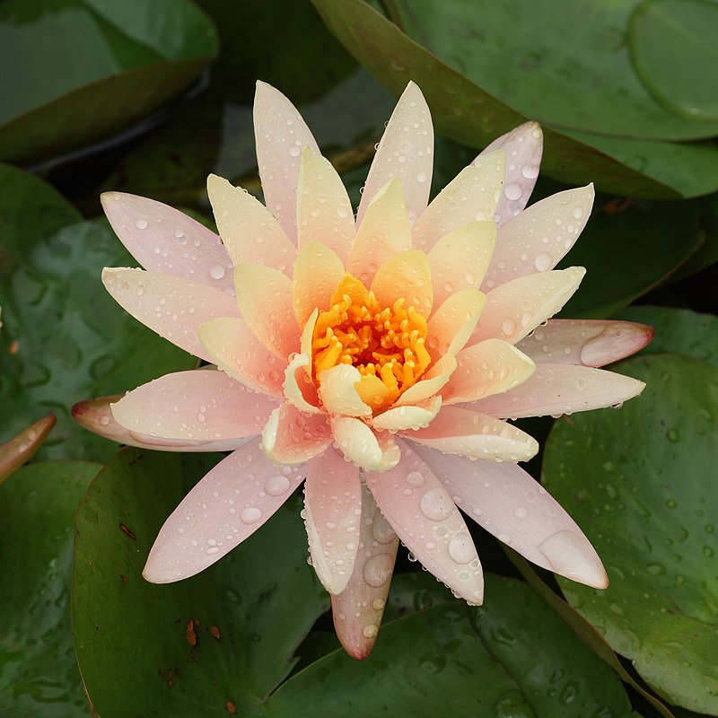
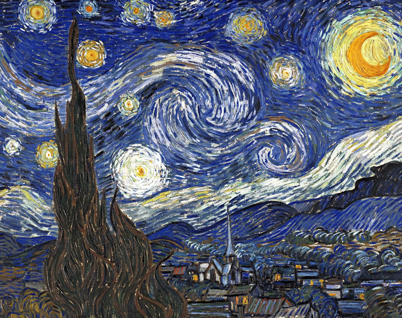
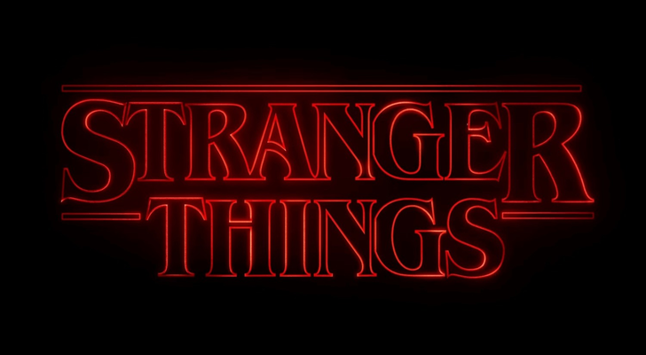
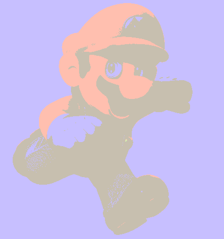
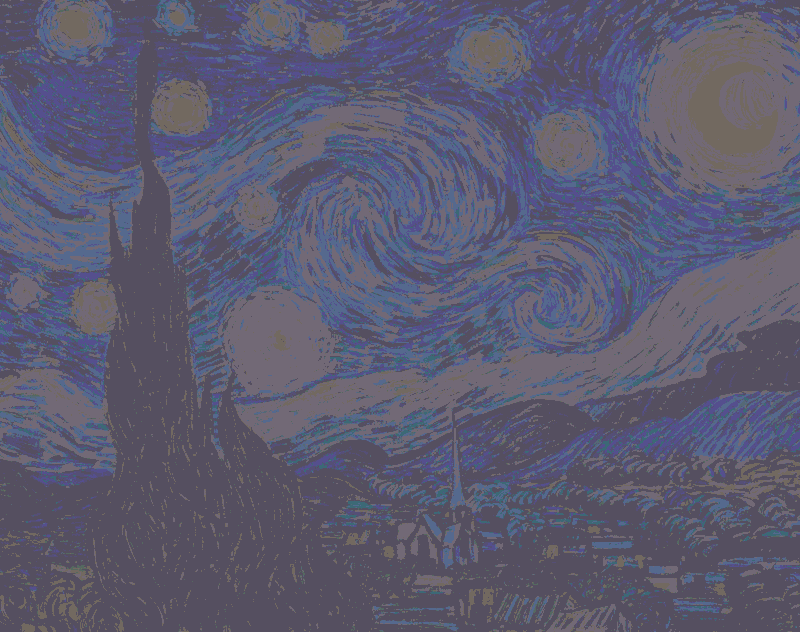
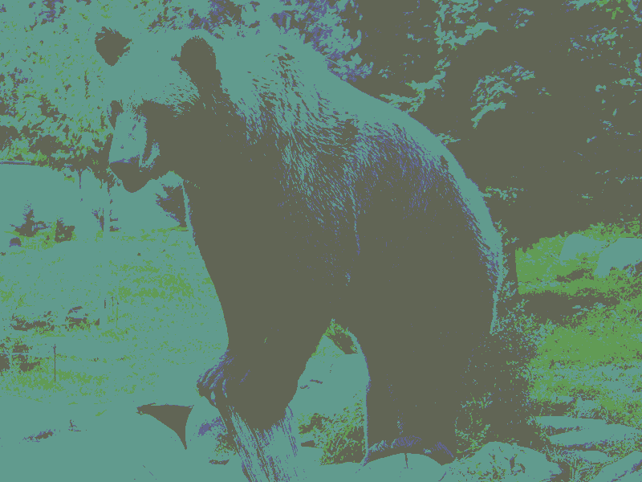
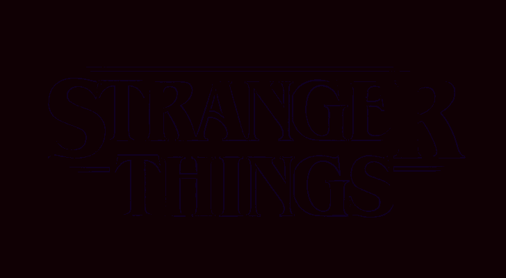
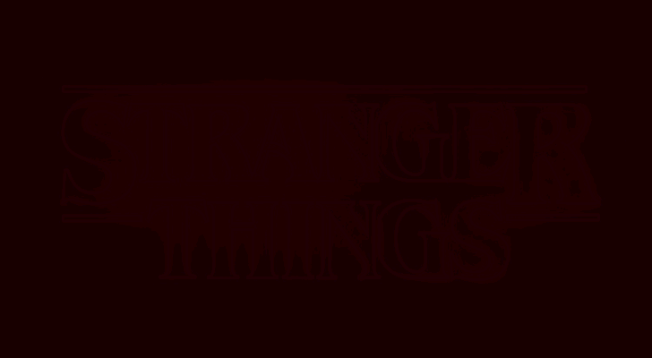
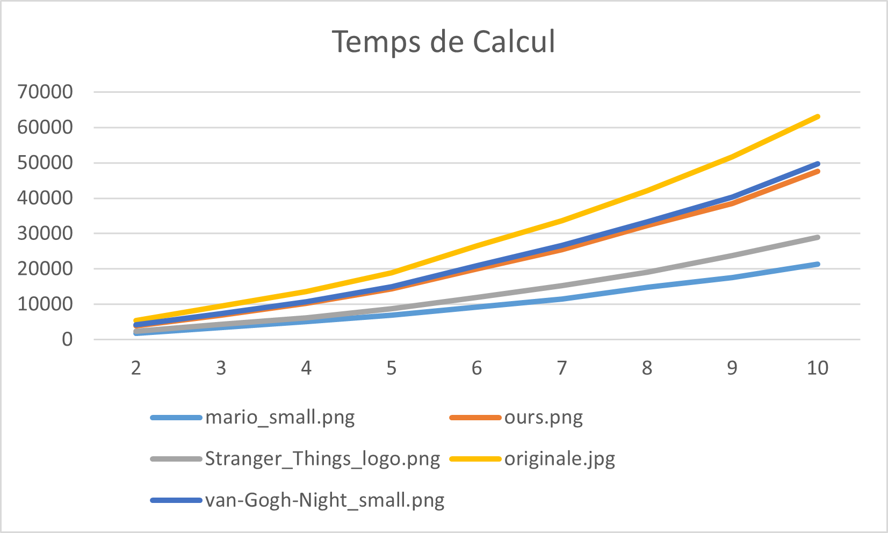

# Test et analyse de la solution personnel

## Lance du test

Le programme de test ne prend qu'un seul argument, 
qui représente le nombre de couleurs. Une fois le programme lancé, 
il essaiera de trouver les images requises dans le dossier actuel 
et générera une nouvelle image dans ce même dossier.

## Images utilisées

Mario! La raison de choisir ce personnage est que son environnement est blanc.
Dans ce cas, les couleurs les plus représentatives devraient inclure le blanc.

Lotus, C'est une belle image. La partie centrale de la fleur de lotus est lumineuse 
tandis que l'environnement qui l'entoure est sombre.

C'est une œuvre abstraite, les couleurs semblent assez chaotiques. Cela pourrait affecter mon programme.

Si vous observez attentivement cet ours, 
vous remarquerez que son corps passe d'une couleur sombre 
en bas à une couleur claire en haut. C'est un bon exemple 
pour tester mon programme.

C'est une image avec des couleurs très sombres. Il serait préférable de 
choisir une image avec des couleurs plus sombres.

## Résultats obtenus

**mario_small.png:**

Réduction à 2 couleurs

4 couleurs

10 couleurs

**originale.jpg:**

Réduction à 2 couleurs

4 couleurs

10 couleurs

**van-Gogh-Night_small.png:**

Réduction à 2 couleurs

4 couleurs

10 couleurs

**ours.png:**

Réduction à 2 couleurs

4 couleurs

10 couleurs

**Stranger_Things_logo.png:**

Réduction à 2 couleurs

4 couleurs

10 couleurs

Graphique représentant la relation entre le nombre de couleurs et le temps de calcul(*ms*).

## Analyse et Conclusion

Vous pouvez observer que plus le nombre de couleurs augmente, 
plus les parties lumineuses de l'image deviennent sombres.

Quant au logo de Stranger Things, l'image devient presque entièrement noire.
(***Si vous regardez attentivement, vous pourrez distinguer les lettres, 
mais ils sont très sombres.***)

Pourquoi cela se produit-il ? La réponse est simple, mon algorithme a un problème.

Prenons l'exemple du logo de Stranger Things. La majeure 
partie de l'image est de couleur noire (***0***), ce qui signifie que 
les valeurs les plus représentatives tendront à se rapprocher de 
la couleur noire (***0***). Parce que lors du calcul, il prend en 
compte les valeurs globales.

En réalité, l'image de Mario présente également le même problème.
L'œil humain est plus capable de distinguer les couleurs claires, 
tandis que pour les couleurs sombres, même si elles ne sont pas 
purement noires, elles peuvent sembler noires à nos yeux.

Un autre problème est que les images générées par ma solution 
ne sont pas assez stables.

Images avec 10 couleurs

Ce phénomène est facile à expliquer. 
Lorsque nous utilisons la méthode de descente de gradient pour 
calculer les chiffres les plus représentatifs, les valeurs des 
nombres peuvent fluctuer. Les nouvelles couleurs formées sont 
déterminées par les trois valeurs de R, G et B combinées. 
Par conséquent, lorsque ces valeurs changent, les 
couleurs peuvent subir des changements importants.

